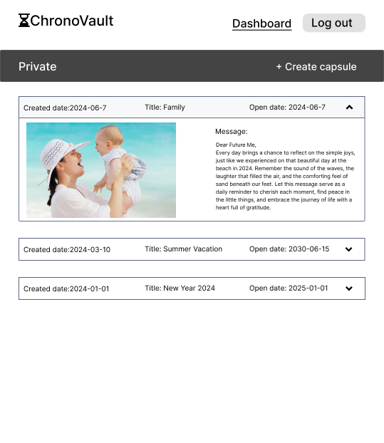

# Project Title

ChronoVault

## Overview

ChronoVault is a virtual time capsule application designed to securely store and preserve digital memories such as images, videos, and text messages. Users can create capsules and lock them to be opened on a specific future date, ensuring that important memories are not lost and can be revisited when desired.

### Problem

My sister often mentioned that she wanted to record messages for her future self, and she would do it, but she either lost them or forgot about them. When I researched, I discovered that many people faced the same problems. So, I created ChronoVault to address this issue by providing a centralized, secure platform where users can store their digital memories and access them on future dates.

### User Profile

- Indivisuals:
  - looking to create capsules.
  - looking to create capsules from anywhere.
  - looking for a reliable place to store their capsules.

### Features

- Users can create personal accounts to manage their capsules.
- Users can create digital capsules containing text, images, and videos.
- Users can set specific dates for when each capsule can be opened.
- Users can view, edit, and delete their capsules as needed.

## Implementation

### Tech Stack

- React
- MySQL
- Node.js
- Express
- AWS S3 _stretch goal_
- Client libraries:
  - react
  - react-router
  - axios
- Server libraries:
  - knex
  - express
  - AWS SDK _stretch goal_
  - Multer
  - bcrypt for password hashing

### APIs

- No external APIs will be used for the first sprint.

### Sitemap

- Home Page: Introduction and guide on how to use ChronoVault.
- Create Capsule: Interface to create new digital capsules.
- Dashboard: Manage and view existing capsules.
- Register: Sign up page for new users.
- Login: Login page for existing users.

### Mockups

#### Home Page


#### Register Page


#### Login Page


#### Dashboard Page


#### Create Capsule Page


#### Dashboard Page (Opened state)



### Data

The data model includes user profiles, digital capsules, and open dates. Relationships are managed to ensure users can only access their capsules, and capsules contain fields for content type (text, image, video), content data, and scheduled open date.

### Endpoints

**Get /dashboard**

- Retrieves all capsules for the logged-in user

Parameters:

- token: JWT of the logged in user

Response:

```
{
  "capsules": [
    {
      "id": 1,
      "title": "New Year 2024",
      "mediatype": "Video",
      "openDate": "2025-01-01",
      "createdDate": "2024-01-01"
      "status": "Locked"
    }
     {
      "id": 2,
      "title": "Vacation",
      "mediatype": "Image",
      "openDate": "2030-06-15",
      "createdDate": "2024-03-10"
      "status": "Locked"
    }
  ]
}
```

**POST /capsules**

- Logged in user can create a capsule

Parameters:

- id: capsule id
- token: JWT of the logged in user

Response:

```
{
    "id": 1,
    "title": "New Year 2024",
    "message": "Future wishes for family.",
    "mediaType": "Video",
    "fileId": "file_upload_id",
    "openDate": "2025-01-01"
    "createdDate": "2024-01-01"
    "status": "Locked"
}
```

**GET /capsules/:id**

- Get capsule by id

Parameters:

- id: Capsule id
- token: JWT of the logged in user

Response:

```
{
    "id": 1,
    "title": "New Year 2024",
    "message": "Future wishes for family.",
    "mediaType": "Video",
    "openDate": "2025-01-01",
    "createdDate": "2024-01-01"
    "status": "Locked"
}
```

**PUT /capsules/:id**

- Logged in user can update their capsule

Parameters:

- id: capsule id
- token: JWT of the logged in user

Response:

```
{
    "id": 1,
    "title": "User's title",
    "message": "User's message",
    "openDate": "User's set open date"
}
```

**DELETE /capsules/:id**

- Logged in user can delete their capsule

Parameters:

- id: capsule id
- token: JWT of the logged in user

Response:

```
{
    "message": "Capsule deleted successfully."
}
```

**POST /users/register**

- Add a user account

Parameters:

- email: User's email,
- password: User's provided password,
- confirm password: confirm User's provided password,

Response:

```
{
    "token": "jwt_token_here"
}
```

**POST /users/login**

- Login a user

Parameters:

- email: User's email
- password: User's provided password

Response:

```
{
    "token": "jwt_token_here"
}
```

### Auth

- JWT auth
  - Authentication is managed with JWTs for secure route access and session management. Tokens are stored in the client's localStorage and verified on the server to grant access to user-specific data and actions.

## Roadmap

- Create Client

  - Set up the React project with essential routes and initial layout.

- Create Server

  - Initialize the Express framework, set up basic server routing, and ensure placeholder responses for early testing.

- Create Migrations

  - Design and implement database schema using MySQL. Develop migrations to set up user and capsule tables.

- User Authentication Features
  -Implement user registration and login functionalities using Express, bcrypt for hashing, and JWT for session management.

  - POST /users/register
  - POST /users/login

- Feature: Dashboard

  - List capsules
  - Create GET /dashboard

- Feature: capsules

  - Get capsules by ID
  - Create GET /capsules/:id

- Feature: Home page

  - Implement homepage to introduce and guide user's

- Bug fixes

- DEMO DAY

## Nice-to-haves

- To change the created date after editing it.
- Profile page: where users can see their information.
- Sharing functionality.
- Feature to include voice recordings with image capsules.
- Opening celebrations: where user's can celebrate their opening on social media and other platform.
- Public capsules: where user's can like and share other user's capsule.
- Search capsule by title functionality.
- Notify user's when receiving a capsule on both email and ChronoVault account if they have one.
